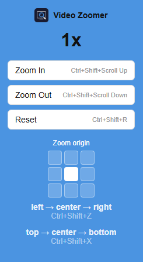

<h1> Video Zoomer</h1>

  

A Chrome extension that lets users zoom into any HTML5 video on any website using keyboard shortcuts or a popup UI.

## Features

- Zoom in, zoom out, and reset zoom on any HTML5 video
- Works on YouTube, embedded YouTube players, and other sites with native HTML5 video
- Zoom in/out via Ctrl+Shift+Scroll, reset via Ctrl+Shift+Middle Click, and move the zoom anchor point with Ctrl+Shift+Arrow keys
- Popup UI showing the current zoom level with buttons
- Zoom state is preserved even when the browser is idle
- Maximum zoom capped at 4x, minimum at 1x
- 3x3 origin picker to control the zoom anchor point via the popup grid or Ctrl+Shift+Arrow keys
- Enable/disable toggle in the popup to turn all extension shortcuts and zoom off entirely, restoring native page behavior

## Keyboard Shortcuts

| Action | Shortcut |
|---|---|
| Zoom In | Ctrl+Shift+Scroll Up |
| Zoom Out | Ctrl+Shift+Scroll Down |
| Reset Zoom | Ctrl+Shift+Middle Click |
| Move zoom origin | Ctrl+Shift+Arrow keys |

## Screenshot

## Installation

1. Clone or download this repository
2. Open Chrome and go to `chrome://extensions`
3. Enable Developer Mode (top right toggle)
4. Click "Load unpacked" and select the project folder
5. The extension icon will appear in the toolbar

## Supported Sites

Works on any site with a native HTML5 video element. YouTube and embedded YouTube players are confirmed to work. Video players rendered inside a Shadow DOM (used by some news sites) are also supported as a fallback when the video cannot be found via normal means. Sites that load video via blob URLs from a different origin (such as Vimeo embeds) may not be supported due to browser security restrictions.

## Project Structure

- `manifest.json` — Extension configuration (MV3)
- `background.js` — Service worker, handles zoom logic and keyboard shortcuts
- `content.js` — Content script, handles Ctrl+Shift+Scroll (zoom), Arrow keys (move origin), and Middle Click (reset)
- `popup.html` — Popup UI structure
- `popup.css` — Popup styles
- `popup.js` — Popup logic, reads zoom state and sends commands
- `icons/icon.png` — Extension icon
- `screenshots/popup.png` — Screenshot used in README
